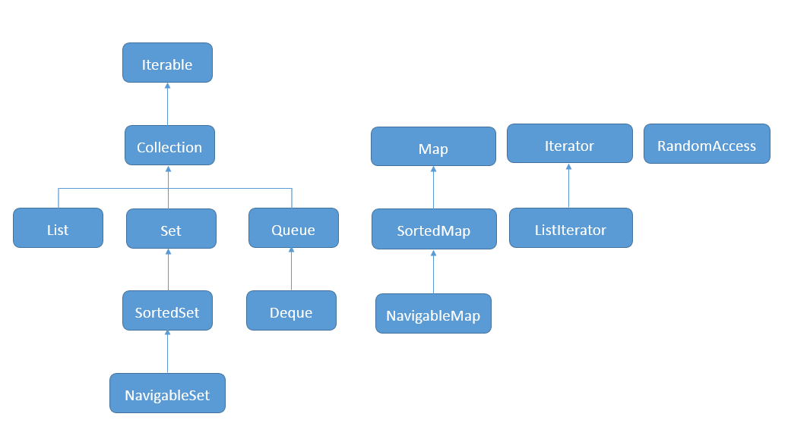

## 集合框架的接口

#### Iterable和Iterator
* Iterable接口定义遍历Collection的两种方式
* Iterator接口定义遍历Collection的具体方法

#### Iterable定义遍历Collection方式
* forEach (Iterator)
* stream (Spliterator)

#### 优先使用Iterator中的remove方法
* 基于效率
* 基于一致性 (遍历时删除不会抛出ConcurrentModificationException)
