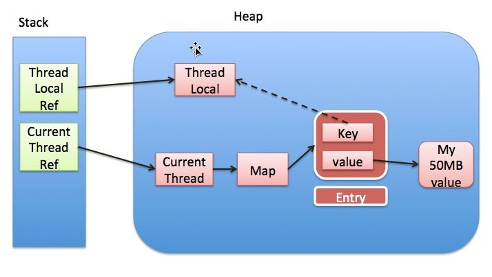

## ThreadLocal

### 实现原理


每个Thread维护一个ThreadLocalMap映射表 (自定义的哈希表实现)，这个映射表的key是ThreadLocal实例本身，value是正真需要存储的值。即ThreadLocal本身并不存储值，它只是作为一个key来让线程从ThreadLocalMap获取value。注意图中虚线，表示ThreadLocalMap是使用ThreadLocal的弱引用作为key。而弱引用的对象会在GC时被回收。
***

### 内存泄露
#### 原因
ThreadLocalMap使用ThreadLocal的弱引用作为key，如果一个ThreadLocal没有外部强引用来引用它，那么系统GC时这个ThreadLocal会被回收，这样ThreadLocalMap中就会出现key为null的Entry，即这些key为null的Entry不可达。如果当前线程不结束，这些key为null的Entry的value会一直存在一条强引用链，而导致链上对象无法回收，造成内存泄露。
```
Thread Ref -> Thread -> ThreadLocalMap -> Entry -> value
```
#### 防护措施
在ThreadLocal的get()，set()，remove()方法被调用时都会试图清除线程中ThreadLocalMap里所有key为null的Entry。
#### 例外
* 使用static的ThreadLocal，延长了ThreadLocal的生命周期，使ThreadLocal无法被回收。尽管ThreadLocal到key是弱引用，但形同虚设，可能导致内存泄露。
```
ThreadLocal Ref -> ThreadLocal -> key
```
* ThreadLocal的get()，set()和remove()方法需要主动调用才能完成清理动作。
***

#### 最佳实践
使用完ThreadLocal都调用它的remove()方法清理数据。
