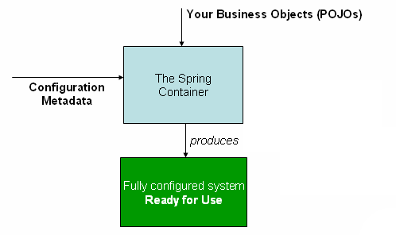

# IoC容器

#### 反转控制或者称依赖注入
传统的对象间构建过程是由某一个对象负责其他对象的初始化，依赖关联。而反转控制则通过IoC容器来负责对象的初始化，并在对象创建的过程中将对象间的依赖关系注入到对象中。

#### Spring的IoC容器
org.springframework.context.ApplicationContext代表了Spring的IoC容器，它根据读取的meta configuration负责对象或称bean的初始化，配置和组装。

#### 构造器注入或基于setter的注入
1. 如果是mandatory依赖则最好用构造器注入，如果不是必须的依赖，则可选择基于setter的注入。
2. 在setter方法上使用@Required表示这个属性对于这个对象是强制依赖。
3. 构造器注入使对象看上去是immutable object，并且保证了对象在使用前被正确的初始化。

#### 默认情况下，IoC中的beans的scope是singleton。在IoC container创建的时候，这些就会beans会被创建并初始化。否则beans只在请求的时候创建。

#### p-namespace和c-namespace

#### ref元素是<constructor-arg/>和<property/>内部定义的最后一级元素。可以用来设置一个bean对另一个由IoC管理的bean的引用。
1. bean属性，通过ref的bean属性设定对目标bean和该bean在同一个IoC容器或该bean父IoC容器的bean的引用。bean属性的值可以是目标bean的id属性，也可以是name属性。
2. parent属性，通过ref的parent属性可以设定对父IoC容器中目标bean的引用，
而且目标bean必须是当前bean父容器中的bean。parent属性的值是目标bean的id属性，或name属性。

#### inner bean
可以没有id/name属性，它总是和外部bean同时创建。它仅能被注入到定义它的外部bean。
