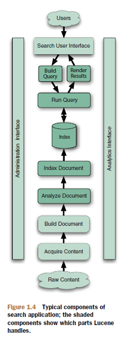

# Chapter1 Meet Lucene

1. Lucene is a high-performance, scalable information retrieval library. It concerns itself with text indexing and searching.
2. Lucene and the components of a search application
Lucene is simply the core indexing and searching component.

#### Indexing
To search large amounts of text quickly, the text should be indexed and be converted into a format that will let you search it rapidly, eliminating the slow sequential scanning process. This conversion process is called indexing, and its output is called an index.
