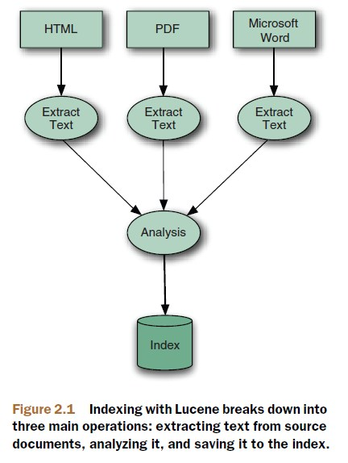

# Building a search index

#### 1. Models content
##### Document
A document is Lucene's atomic unit of indexing and searching. It's a container that holds one or more fields, which in turn contain the 'real' content.

##### Field
Each field has a name to identify it, a text or binary value, and a series of detailed options that describe what Lucence should do with the field's value when you add the document to the index.
At a high level, there are three things lucene can do with each field:  
1) The value may be indexed or not. A field must be indexed if you intend to search on it. Only text fields may be indexed, binary valued fields may be only stored.  
2) If it's indexed, the field may also optionally store term vectors , which are collectively a miniature inverted index for that one field, allowing you to retrieve all of its tokens.  
3) Separately, the field value may be stored, meaning a verbatim copy of the unanalyzed value is written way in the index so that it can latter be retrieved.

##### Flexible schema
Lucene has no notion of a fixed global schema.

#### 2. Indexing process
Indexing with Lucene breaks down into three main operations.

##### Extracting text and creating the document
To index data with Lucene, you must extract plain text from it, the format that Lucene can digest, and then create a Lucene document.

##### Analysis
It's a process that splits the textual data into a stream of tokens, and performs a number of optional operations on them.

##### Adding to the index
After the input has been analyzed, Lucence stores the input in a data structure known as inverted index. This data structure makes efficient use of disk space while allowing quick keyword lookups.

#### 3. Index segments
Every Lucene index consist of one or more segments. Each segment is a standalone index, holding a subset of all indexed documents.  
Each segment, in turn, consist of multiple files, of the form \_X.<ext>, where X is the segment's name and <ext> is the extension that identifies which part of the index that file corresponds to.  
There are separate files to hold the different parts of the index (term vectors, stored files, inverted index, and so on).  
There's one special file, referred to as the segments and named segments_<N>, that references all live segments. Lucene first opens this file, and then opens each segments referenced by it. The value <N>, called 'the generation'.

#### 4. Field options
##### Field options for indexing
The options for indexing (Field.Index.\*) control how the text in the field will be made searchable via the inverted index.
1) Index.ANALYZED  
Use the analyzer to break the field's value into a stream of  separate tokens and make each token searchable. This option is useful for normal text field (body, title, abstract, etc).  
2) Index.NOT\_ANALYZED  
Do index the field, but don't analyze the string value. Instead, treat the field's entire value as a single token and make that token searchable. This option is especially useful for enabling 'exact match' searching.  
3) Index.ANALYZED\_NO\_NORMS  
A variant of Index.ANALYZED that doesn't store norms information in the index. Norms record index-time boost information in the index but can be memory consuming when you're searching.  
4) Index.NOT\_ANALYZED_NO_NORMS  
Just like Index.NOT_ANALYZED, but also doesn't store norms. This option is frequently used to save index space and memory usage during searching, because single-token fields don't need the norms information unless they're boosted.  
5) Index.NO  
Don't make this field's value available for searching.

##### Field options for storing fields
The options for stored fields (Field.Store.\*) determine whether the field's exact value should be stored away so that you can later retrieve it during searching.  
1) Store.YES  
When the value is stored, the original string in its entirely is recorded in the index and may be retrieved by an IndexReader.  
2) Store.NO  
Doesn't store the value.

##### Field options for term vectors
Term vectors are a mix between an indexed fields and a stored fields. They're keyed first by document id, secondarily by term. It means they store a miniature inverted index for that one document. Unlike a stored field, where the original string content is stored verbatim, term vectors store the actual separate  terms that were produced by the analyzer, allowing you to retrieve all terms for each field, and the frequency of their occurrence with the document, sorted in lexicographic order. The tokens(terms) also have position and offset information.  
1) TermVector.YES  
Records the unique terms that occurred, and their counts, in each document, but doesn't store any positions or offsets information.  
2) TermVector.WITH\_POSITION  
3) TermVector.WITH\_OFFSET  
4) TermVector.WITH\_POSITION\_OFFSET  
5) TermVector.NO  

##### Multivalued fields
Add the same field with different value.

#### 5. Boosting documents and fields
Boosting may be done during indexing, or during searching. Search-time boost is more dynamic, but also may be somewhat more CPU intensive.

##### Boosting documents

##### Boosting fields

##### Norms  
During indexing, all sources of index-time boosts are combined into a single floatingpoint number for each indexed field in the document. The document may have its own boost; each field may have a boost; and Lucene computes an automatic boost based on the number of tokens in the field (shorter fields have a higher boost). These boosts are combined and then compactly encoded (quantized) into a single byte, which is stored per field per document. During searching, norms for any field being searched are loaded into memory, decoded back into a floating-point number, and used when computing the relevance score.

#### 6. Indexing number, dates, and times
As of version 2.9, you simply create a NumericField, use one of its set<Type>Value methods to record the value, and then add the NumericField to your document just like any other Field. Each numeric value is indexed using a trie structure, which logically assigns a single numeric value to larger and larger predefined brackets. Each bracket is assigned a unique term in the index, so that retrieving all documents within a single bracket is fast.

#### 7. Field truncation

#### 8. Near-real-time search
By providing a method named getReader() in IndexWriter to search on documents quickly after indexing them.

#### 9. Optimizing an index
Index optimization consumes substantial CPU and input/output (I/O) resources. Another important cost to be aware of is that optimizing requires roughly triple size of your index during optimization.

#### 10. Other directory implementations
Directory|Description
:--|:--
SimpleFSDirectory|A simplistic `Directory` that stores files in the file system, using `java.io.*` APIs. It doesn't scale well with many threads.
NIOFSDirectory|A `Directory` that stores files in the file system, using `java.nio.*` APIS. This does scale well with threads on all platforms except Microsoft Windows, due to a longstanding issue with Sun's Java Runtime Environment(JRE).
MMapDirectory|A `Directory` that uses memory-mapped I/O to access files. This is a good choice on 64-bit JREs, or on 32-bit JREs where the size of the index is relatively small.
RAMDirectory|A `Directory` that stores all files in RAM.
FileSwitchDirectory|A `Directory` that takes two directories inI, and switches between these directories based on file extension.

#### 11. Concurrency, thread safety, and locking issues
