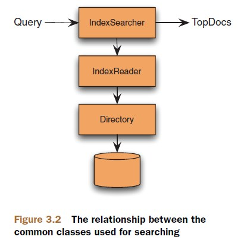

# Chapter3 Adding search to your app

#### 1. Lucene's primary searching API

Class|Purpose
:--|:--
IndexSearcher|Gateway to searching an index. All searches come through an `IndexSearcher` instance using any of the several overloaded `search` methods.
Query (and subclasses)|Concrete subclasses encapsulate logic for a particular query type. Instances of `Query` are passed to and `IndexSearcher's search` method.
QueryParser|Processes a human-entered (and readeable) expression into a concrete `Query` object.
TopDocs|Holds the top scoring documents, returned by `IndexSearcher.search`.
ScoreDoc|Provides access to each search result in `TopDocs`.

#### 2. Using IndexSearcher
##### Create an IndexSearcher  
IndexReader does all the heavy lifting to open all index files and expose a low-level reader API, while IndexSeacher is a rather thin veneer.  
There are two approaches to create an IndexSearcher, one is to create the IndexSearcher from a directory, another is to create IndexSearcher from a IndexReader.  

