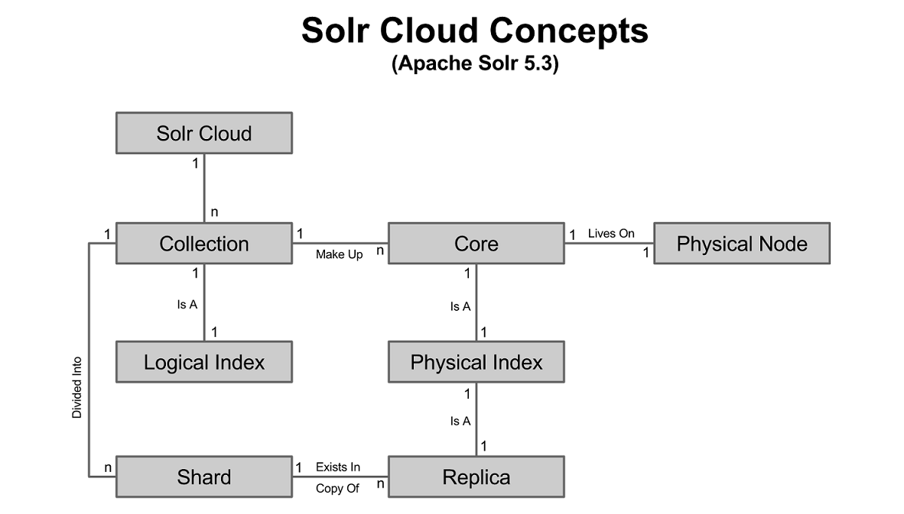

# SolrCloud基本概念

#### 1. Core和Collection的区别
core是一个solr实例上包含一个物理索引的结构。collection是由若干个core组成的一个逻辑索引，而cores分布在多个节点(nodes)之上。  
1) 在标准单节点(node)solr实例中，一个core相当于一个collection。而一个collection代表一个逻辑索引。  
2) 在SolrCloud中，collection由一个或多个节点（node）上的Shard（core）组成。collection仍代表一个逻辑上的索引，同时cores存储在collection中不同的shards上。

#### 2. 在SolrCloud环境中Collections由一个或多个Shards组成。Shards有一个或多个Replicas。每个Replica都是一个core。

#### 3. Nodes
在SolrCloud中，一个node是一个运行Solr实例的JVM，通常称为Solr节点。

#### 4. Shards
当一个节点上的数据太大时，可通过创建一个或多个Shards来拆分数据并将拆分后的各个部分分开存储。每个Shard都是逻辑索引的一部分，同时它是所有节点上同样被拆分部分的集合（leader和replicas）。利用基于hash的文档路由策略将文档分配到Shard。

#### 5. Replica
一个Shard在一个collection中的一份拷贝，每个replica都被实现为一个solr core。

#### 6. Cluster
1) Cluster是一组由zookeeper管理的solr节点，当注册到zookeeper已启动solr实例数量大于一个时，Cluster会自动创建。  
2) Cluster包含numShards个Shards。当前运行solr实例个数等于numShards时，如再启动属于同一个collection的solr节点，此节点将作为replica分配给已运行solr实例（leader）的Shard。之后启动的solr节点将分配给拥有最少replica的Shard，或分配给ShardId最小的Shard（拥有相同数量的replicas）。或在solr实例启动时通过指定shardId来手动分配replica到指定Shard。

#### 7. Leader和Replicas
1) 基于先到先服务原则和zookeeper处理机制，leader会被自动选中。如果一个leader停止，则同一个Shard上的另外一个replica会被选为leader。  
2) 当一个文档送到某节点要生成索引，系统会先判断该节点时leader还是replica；如果节点是replica，则文档会被转发到该Shard的leader；如果节点是leader，则SolrCloud负责将文档转发到合适的Shard；文档到达指定Shard的leader后生成索引，并将生成索引发送给自己和其他replicas。

#### 8. SolrCloud重要的逻辑上概念
1) Cluster可包含多个Collections。  
2) 一个collection可被切分为多个Shards（每个Shard包含collection中文档的一个子集，全部Shards合并即collection包含的所有文档）。

#### 9. SolrCloud重要的物理上概念
1) 一个Cluster由若干个运行solr实例的节点构成。  
2) 每个solr节点可包含多个Cores。  
3) 在Cluster 上每个Core都是一个逻辑上Shard的物理副本。  
4) 同属一个Collection的replicas使用相同的配置文件。  
5) Shard副本的数量决定collection所具备的冗余性和容错性能，同时决定了理论上大负载情况下并行处理搜索请求的数量。  

