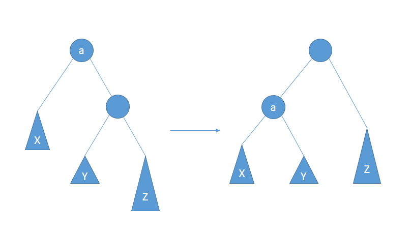
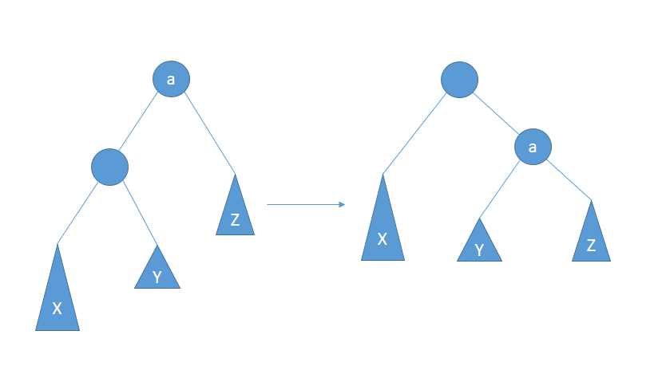
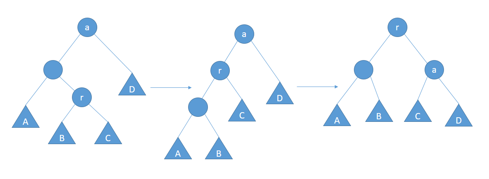
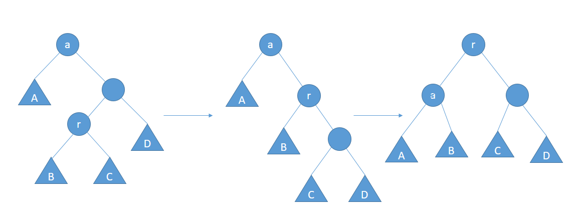

## 自平衡二叉查找树 (AVL tree)

### 平衡
插入新节点后，将需要重新平衡的节点称为a。出现不平衡是因为节点a的两棵子树高度差大于1，可能有以下四种情况。
#### 左左
对a的左儿子的左子树进行一次插入，需要向右单旋转。
#### 左右
对a的左儿子的右子树进行一次插入，需要先向左单旋转一次后再向右单旋转一次。
#### 右左
对a的右儿子的左子树进行一次插入，需要先向右单旋转一次后再向左单旋转一次。
#### 右右
对a的右儿子的右子树进行一次插入，需要向左单旋转。
***

### 单旋转
#### 左单旋
* 待平衡节点a将下沉，a.right节点将成为新子树的根节点。
* 原待平衡节点a.right节点的左子树 (Y) 成为原待平衡节点a的右子树。

```
private <T> AVLNode<T> rotateWithRightChild(AVLNode<T> node) {
    AVLNode<T> rightChild = node.right;
    node.right = rightChild.left;
    rightChild.left = node;
    node.height = Math.max(height(node.left), height(node.right)) + 1;
    rightChild.height = Math.max(height(node), height(rightChild.right)) + 1;
    return rightChild;
}
```

#### 右单旋
* 待平衡节点a将下沉，a.left节点将成为新子树的根节点。
* 原待平衡节点a.left节点的右子树 (Y) 成为原待平衡节点a的左子树。

```
private <T> AVLNode<T> rotateWithLeftChild(AVLNode<T> node) {
    AVLNode<T> leftChild = node.left;
    node.left = leftChild.right;
    leftChild.right = node;
    node.height = Math.max(height(node.left), height(node.right)) + 1;
    leftChild.height = Math.max(height(leftChild.left), height(node)) + 1;
    return leftChild;
}
```

***

### 双旋转
#### 左-右双旋转
* 先将待平衡点a的左子树根节点作为待平衡点进行一次左单旋转。
* 然后对待平衡点进行一次右单旋转。

```
private <T> AVLNode<T> doubleWithLeftChild(AVLNode<T> node) {
    node.left = rotateWithRightChild(node.left);
    return rotateWithLeftChild(node);
}
```

#### 右-左双旋转
* 先将待平衡点a的右子树根节点作为待平衡点进行一次右单旋转。
* 然后对待平衡点进行一次左单旋转。

```
private <T> AVLNode<T> doubleWithRightChild(AVLNode<T> node) {
    node.right = rotateWithLeftChild(node.right);
    return rotateWithRightChild(node);
}
```

***
